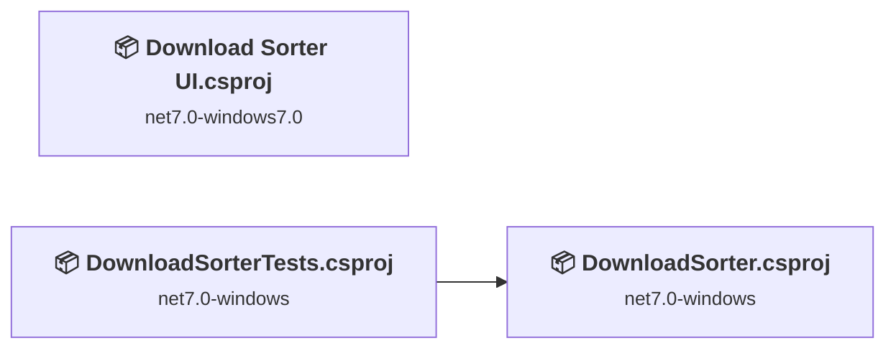
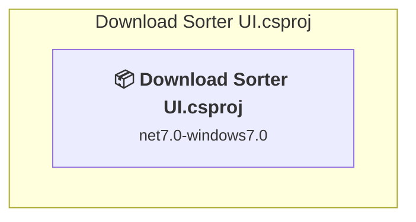
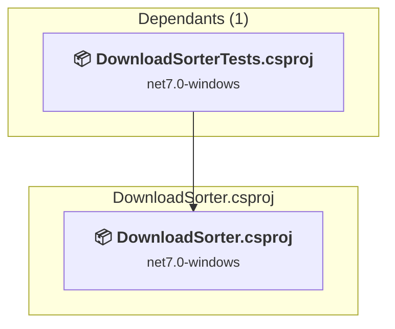
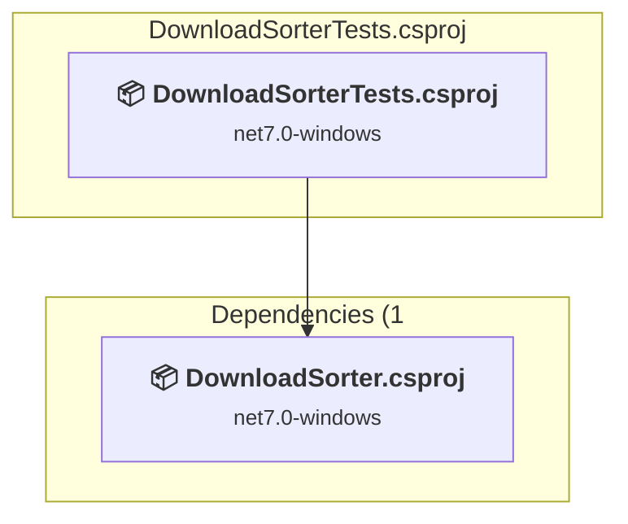

# Projects and dependencies analysis

This document provides a comprehensive overview of the projects and their dependencies in the context of upgrading to .NETCoreApp,Version=v10.0.

## Table of Contents

- [Executive Summary](#executive-Summary)
  - [Highlevel Metrics](#highlevel-metrics)
  - [Projects Compatibility](#projects-compatibility)
  - [Package Compatibility](#package-compatibility)
  - [API Compatibility](#api-compatibility)
- [Aggregate NuGet packages details](#aggregate-nuget-packages-details)
- [Top API Migration Challenges](#top-api-migration-challenges)
  - [Technologies and Features](#technologies-and-features)
  - [Most Frequent API Issues](#most-frequent-api-issues)
- [Projects Relationship Graph](#projects-relationship-graph)
- [Project Details](#project-details)

  - [Download Sorter UI\Download Sorter UI.csproj](#download-sorter-uidownload-sorter-uicsproj)
  - [DownloadSorter\DownloadSorter.csproj](#downloadsorterdownloadsortercsproj)
  - [DownloadSorterTests\DownloadSorterTests.csproj](#downloadsortertestsdownloadsortertestscsproj)

## Executive Summary

### Highlevel Metrics

| Metric | Count | Status |
| :--- | :---: | :--- |
| Total Projects | 3 | All require upgrade |
| Total NuGet Packages | 6 | 2 need upgrade |
| Total Code Files | 9 |  |
| Total Code Files with Incidents | 7 |  |
| Total Lines of Code | 713 |  |
| Total Number of Issues | 114 |  |
| Estimated LOC to modify | 109+ | at least 15.3% of codebase |

### Projects Compatibility

| Project | Target Framework | Difficulty | Package Issues | API Issues | Est. LOC Impact | Description |
| :--- | :---: | :---: | :---: | :---: | :---: | :--- |
| [Download Sorter UI\Download Sorter UI.csproj](#download-sorter-uidownload-sorter-uicsproj) | net7.0-windows7.0 | 🟡 Medium | 0 | 109 | 109+ | WinForms, Sdk Style = True |
| [DownloadSorter\DownloadSorter.csproj](#downloadsorterdownloadsortercsproj) | net7.0-windows | 🟢 Low | 2 | 0 |  | DotNetCoreApp, Sdk Style = True |
| [DownloadSorterTests\DownloadSorterTests.csproj](#downloadsortertestsdownloadsortertestscsproj) | net7.0-windows | 🟢 Low | 0 | 0 |  | DotNetCoreApp, Sdk Style = True |

### Package Compatibility

| Status | Count | Percentage |
| :--- | :---: | :---: |
| ✅ Compatible | 4 | 66.7% |
| ⚠️ Incompatible | 0 | 0.0% |
| 🔄 Upgrade Recommended | 2 | 33.3% |
| ***Total NuGet Packages*** | ***6*** | ***100%*** |

### API Compatibility

| Category | Count | Impact |
| :--- | :---: | :--- |
| 🔴 Binary Incompatible | 108 | High - Require code changes |
| 🟡 Source Incompatible | 1 | Medium - Needs re-compilation and potential conflicting API error fixing |
| 🔵 Behavioral change | 0 | Low - Behavioral changes that may require testing at runtime |
| ✅ Compatible | 818 |  |
| ***Total APIs Analyzed*** | ***927*** |  |

## Aggregate NuGet packages details

| Package | Current Version | Suggested Version | Projects | Description |
| :--- | :---: | :---: | :--- | :--- |
| coverlet.collector | 6.0.0 |  | [DownloadSorterTests.csproj](#downloadsortertestsdownloadsortertestscsproj) | ✅Compatible |
| Microsoft.Extensions.Hosting.WindowsServices | 7.0.1 | 10.0.3 | [DownloadSorter.csproj](#downloadsorterdownloadsortercsproj) | NuGet package upgrade is recommended |
| Microsoft.NET.Test.Sdk | 17.6.0 |  | [DownloadSorterTests.csproj](#downloadsortertestsdownloadsortertestscsproj) | ✅Compatible |
| MSTest.TestAdapter | 3.0.4 |  | [DownloadSorterTests.csproj](#downloadsortertestsdownloadsortertestscsproj) | ✅Compatible |
| MSTest.TestFramework | 3.0.4 |  | [DownloadSorterTests.csproj](#downloadsortertestsdownloadsortertestscsproj) | ✅Compatible |
| Newtonsoft.Json | 13.0.3 | 13.0.4 | [DownloadSorter.csproj](#downloadsorterdownloadsortercsproj) | NuGet package upgrade is recommended |

## Top API Migration Challenges

### Technologies and Features

| Technology | Issues | Percentage | Migration Path |
| :--- | :---: | :---: | :--- |
| Windows Forms | 108 | 99.1% | Windows Forms APIs for building Windows desktop applications with traditional Forms-based UI that are available in .NET on Windows. Enable Windows Desktop support: Option 1 (Recommended): Target net9.0-windows; Option 2: Add <UseWindowsDesktop>true</UseWindowsDesktop>; Option 3 (Legacy): Use Microsoft.NET.Sdk.WindowsDesktop SDK. |
| GDI+ / System.Drawing | 1 | 0.9% | System.Drawing APIs for 2D graphics, imaging, and printing that are available via NuGet package System.Drawing.Common. Note: Not recommended for server scenarios due to Windows dependencies; consider cross-platform alternatives like SkiaSharp or ImageSharp for new code. |
| Windows Forms Legacy Controls | 1 | 0.9% | Legacy Windows Forms controls that have been removed from .NET Core/5+ including StatusBar, DataGrid, ContextMenu, MainMenu, MenuItem, and ToolBar. These controls were replaced by more modern alternatives. Use ToolStrip, MenuStrip, ContextMenuStrip, and DataGridView instead. |

### Most Frequent API Issues

| API | Count | Percentage | Category |
| :--- | :---: | :---: | :--- |
| T:System.Windows.Forms.ToolStripMenuItem | 16 | 14.7% | Binary Incompatible |
| T:System.Windows.Forms.NotifyIcon | 15 | 13.8% | Binary Incompatible |
| T:System.Windows.Forms.ContextMenuStrip | 10 | 9.2% | Binary Incompatible |
| T:System.Windows.Forms.Application | 4 | 3.7% | Binary Incompatible |
| P:System.Windows.Forms.NotifyIcon.Visible | 3 | 2.8% | Binary Incompatible |
| T:System.Windows.Forms.FormWindowState | 3 | 2.8% | Binary Incompatible |
| T:System.Windows.Forms.AutoScaleMode | 3 | 2.8% | Binary Incompatible |
| M:System.Windows.Forms.NotifyIcon.ShowBalloonTip(System.Int32) | 2 | 1.8% | Binary Incompatible |
| P:System.Windows.Forms.NotifyIcon.BalloonTipText | 2 | 1.8% | Binary Incompatible |
| P:System.Windows.Forms.NotifyIcon.BalloonTipTitle | 2 | 1.8% | Binary Incompatible |
| P:System.Windows.Forms.Form.ShowInTaskbar | 2 | 1.8% | Binary Incompatible |
| M:System.Windows.Forms.Control.Hide | 2 | 1.8% | Binary Incompatible |
| M:System.Windows.Forms.Form.#ctor | 2 | 1.8% | Binary Incompatible |
| M:System.Windows.Forms.Control.ResumeLayout(System.Boolean) | 2 | 1.8% | Binary Incompatible |
| P:System.Windows.Forms.Control.Name | 2 | 1.8% | Binary Incompatible |
| E:System.Windows.Forms.ToolStripItem.Click | 2 | 1.8% | Binary Incompatible |
| P:System.Windows.Forms.ToolStripItem.Text | 2 | 1.8% | Binary Incompatible |
| P:System.Windows.Forms.ToolStripItem.Size | 2 | 1.8% | Binary Incompatible |
| P:System.Windows.Forms.ToolStripItem.Name | 2 | 1.8% | Binary Incompatible |
| M:System.Windows.Forms.Control.SuspendLayout | 2 | 1.8% | Binary Incompatible |
| M:System.Windows.Forms.ToolStripMenuItem.#ctor | 2 | 1.8% | Binary Incompatible |
| T:System.Windows.Forms.HighDpiMode | 2 | 1.8% | Binary Incompatible |
| M:System.Windows.Forms.Form.Close | 1 | 0.9% | Binary Incompatible |
| F:System.Windows.Forms.FormWindowState.Minimized | 1 | 0.9% | Binary Incompatible |
| P:System.Windows.Forms.Form.WindowState | 1 | 0.9% | Binary Incompatible |
| P:System.Windows.Forms.Form.Text | 1 | 0.9% | Binary Incompatible |
| P:System.Windows.Forms.Form.ClientSize | 1 | 0.9% | Binary Incompatible |
| F:System.Windows.Forms.AutoScaleMode.Font | 1 | 0.9% | Binary Incompatible |
| P:System.Windows.Forms.ContainerControl.AutoScaleMode | 1 | 0.9% | Binary Incompatible |
| P:System.Windows.Forms.ContainerControl.AutoScaleDimensions | 1 | 0.9% | Binary Incompatible |
| P:System.Windows.Forms.Control.Size | 1 | 0.9% | Binary Incompatible |
| T:System.Windows.Forms.ToolStripItemCollection | 1 | 0.9% | Binary Incompatible |
| P:System.Windows.Forms.ToolStrip.Items | 1 | 0.9% | Binary Incompatible |
| M:System.Windows.Forms.ToolStripItemCollection.AddRange(System.Windows.Forms.ToolStripItem[]) | 1 | 0.9% | Binary Incompatible |
| P:System.Windows.Forms.NotifyIcon.Text | 1 | 0.9% | Binary Incompatible |
| T:System.Drawing.Icon | 1 | 0.9% | Source Incompatible |
| P:System.Windows.Forms.NotifyIcon.Icon | 1 | 0.9% | Binary Incompatible |
| P:System.Windows.Forms.NotifyIcon.ContextMenuStrip | 1 | 0.9% | Binary Incompatible |
| M:System.Windows.Forms.ContextMenuStrip.#ctor(System.ComponentModel.IContainer) | 1 | 0.9% | Binary Incompatible |
| M:System.Windows.Forms.NotifyIcon.#ctor(System.ComponentModel.IContainer) | 1 | 0.9% | Binary Incompatible |
| M:System.Windows.Forms.Form.Dispose(System.Boolean) | 1 | 0.9% | Binary Incompatible |
| T:System.Windows.Forms.Form | 1 | 0.9% | Binary Incompatible |
| F:System.Windows.Forms.HighDpiMode.SystemAware | 1 | 0.9% | Binary Incompatible |
| M:System.Windows.Forms.Application.SetHighDpiMode(System.Windows.Forms.HighDpiMode) | 1 | 0.9% | Binary Incompatible |
| M:System.Windows.Forms.Application.SetCompatibleTextRenderingDefault(System.Boolean) | 1 | 0.9% | Binary Incompatible |
| M:System.Windows.Forms.Application.EnableVisualStyles | 1 | 0.9% | Binary Incompatible |
| M:System.Windows.Forms.Application.Run(System.Windows.Forms.Form) | 1 | 0.9% | Binary Incompatible |

## Projects Relationship Graph

Legend:
📦 SDK-style project
⚙️ Classic project

## Project Details

### Download Sorter UI\Download Sorter UI.csproj

#### Project Info

- **Current Target Framework:** net7.0-windows7.0
- **Proposed Target Framework:** net10.0-windows
- **SDK-style**: True
- **Project Kind:** WinForms
- **Dependencies**: 0
- **Dependants**: 0
- **Number of Files**: 5
- **Number of Files with Incidents**: 5
- **Lines of Code**: 202
- **Estimated LOC to modify**: 109+ (at least 54.0% of the project)

#### Dependency Graph

Legend:
📦 SDK-style project
⚙️ Classic project

### API Compatibility

| Category | Count | Impact |
| :--- | :---: | :--- |
| 🔴 Binary Incompatible | 108 | High - Require code changes |
| 🟡 Source Incompatible | 1 | Medium - Needs re-compilation and potential conflicting API error fixing |
| 🔵 Behavioral change | 0 | Low - Behavioral changes that may require testing at runtime |
| ✅ Compatible | 175 |  |
| ***Total APIs Analyzed*** | ***284*** |  |

#### Project Technologies and Features

| Technology | Issues | Percentage | Migration Path |
| :--- | :---: | :---: | :--- |
| GDI+ / System.Drawing | 1 | 0.9% | System.Drawing APIs for 2D graphics, imaging, and printing that are available via NuGet package System.Drawing.Common. Note: Not recommended for server scenarios due to Windows dependencies; consider cross-platform alternatives like SkiaSharp or ImageSharp for new code. |
| Windows Forms Legacy Controls | 1 | 0.9% | Legacy Windows Forms controls that have been removed from .NET Core/5+ including StatusBar, DataGrid, ContextMenu, MainMenu, MenuItem, and ToolBar. These controls were replaced by more modern alternatives. Use ToolStrip, MenuStrip, ContextMenuStrip, and DataGridView instead. |
| Windows Forms | 108 | 99.1% | Windows Forms APIs for building Windows desktop applications with traditional Forms-based UI that are available in .NET on Windows. Enable Windows Desktop support: Option 1 (Recommended): Target net9.0-windows; Option 2: Add <UseWindowsDesktop>true</UseWindowsDesktop>; Option 3 (Legacy): Use Microsoft.NET.Sdk.WindowsDesktop SDK. |

### DownloadSorter\DownloadSorter.csproj

#### Project Info

- **Current Target Framework:** net7.0-windows
- **Proposed Target Framework:** net10.0--windows
- **SDK-style**: True
- **Project Kind:** DotNetCoreApp
- **Dependencies**: 0
- **Dependants**: 1
- **Number of Files**: 4
- **Number of Files with Incidents**: 1
- **Lines of Code**: 471
- **Estimated LOC to modify**: 0+ (at least 0.0% of the project)

#### Dependency Graph

Legend:
📦 SDK-style project
⚙️ Classic project

### API Compatibility

| Category | Count | Impact |
| :--- | :---: | :--- |
| 🔴 Binary Incompatible | 0 | High - Require code changes |
| 🟡 Source Incompatible | 0 | Medium - Needs re-compilation and potential conflicting API error fixing |
| 🔵 Behavioral change | 0 | Low - Behavioral changes that may require testing at runtime |
| ✅ Compatible | 622 |  |
| ***Total APIs Analyzed*** | ***622*** |  |

### DownloadSorterTests\DownloadSorterTests.csproj

#### Project Info

- **Current Target Framework:** net7.0-windows
- **Proposed Target Framework:** net10.0--windows
- **SDK-style**: True
- **Project Kind:** DotNetCoreApp
- **Dependencies**: 1
- **Dependants**: 0
- **Number of Files**: 3
- **Number of Files with Incidents**: 1
- **Lines of Code**: 40
- **Estimated LOC to modify**: 0+ (at least 0.0% of the project)

#### Dependency Graph

Legend:
📦 SDK-style project
⚙️ Classic project

### API Compatibility

| Category | Count | Impact |
| :--- | :---: | :--- |
| 🔴 Binary Incompatible | 0 | High - Require code changes |
| 🟡 Source Incompatible | 0 | Medium - Needs re-compilation and potential conflicting API error fixing |
| 🔵 Behavioral change | 0 | Low - Behavioral changes that may require testing at runtime |
| ✅ Compatible | 21 |  |
| ***Total APIs Analyzed*** | ***21*** |  |

